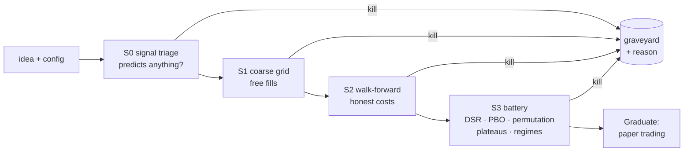

# Crucible

**A backtesting engine designed to reject strategies.**

Most backtesters are optimized to show you an equity curve going up. Crucible
is optimized to tell you, as fast and as honestly as possible, that your idea
doesn't work — because on the rare occasion it can't, that's evidence worth
having. Rust, event-driven, built on Databento CME futures data.

<!-- CI badge: add after first push
[](…)
-->

## Why this exists

The standard failure mode of strategy research is a pipeline that quietly
flatters the researcher: lookahead leaks, free fills, one in-sample split,
a thousand silent parameter trials behind one reported Sharpe. Crucible's
design inverts each of those defaults:

- **No lookahead by construction.** Every event carries an *availability
  time* (a 1-minute bar opening at 09:30 doesn't exist until 09:31); replay,
  decisions, and fills are ordered by it. Orders can never fill against the
  bar that triggered them.
- **Costs are named, never implied.** Fill models are explicit, versioned
  assumptions (`free_fills`, `spread_cross`, later an MBO-calibrated queue
  sim). Every result states the assumption that produced it, and every
  scorecard includes a cost-sensitivity sweep.
- **Trials are counted automatically.** A registry records every run of every
  hypothesis family; reported Sharpe ratios ship with their deflated
  counterpart (Bailey & López de Prado) and PBO estimates.
- **The null hypothesis is a first-class citizen.** Strategies are re-run on
  seeded random walks and block-shuffled data; performance that survives
  shuffling is treated as a bug detector, not a discovery.
- **Bit-exact determinism.** Same config + same data ⇒ identical results,
  enforced in CI on every commit.

## The funnel

Ideas flow through staged gates — cheap and optimistic first, expensive and
brutal last. Most ideas should die in seconds:



## Quick start

```bash
cargo run -p crucible-cli -- demo
```

runs the reference SMA-cross strategy over 100,000 seeded random-walk bars
under two fill models and prints the comparison. The punchline is the point:
the data is a random walk, so the honest line should lose — an engine change
that makes the demo profitable under costs introduced a bug, not an edge.

The demo needs no configuration at all. Real data does:

## Configuration

Two environment variables, neither with a default:

| Variable | Meaning |
|---|---|
| `DATABENTO_API_KEY` | Databento API key. Read from the environment by bin targets only, never passed as an argument or written to a config, manifest, or log. |
| `CRUCIBLE_DATA_DIR` | Archive root (`raw/`, `curated/`, `manifest.jsonl`). Must live **outside** the repo — it grows to 16 years of bars plus rolling L1/L2/L3 windows. |

Export them in your shell, or put them in a `.env` at the repo root — it is
gitignored, and a real environment variable always beats the file, so CI
secrets and one-off overrides keep working:

```dotenv
DATABENTO_API_KEY=db-your-key-here
CRUCIBLE_DATA_DIR=E:/crucible-data
```

**Windows paths:** a backslash starts an escape sequence in dotenv syntax.
Use forward slashes (`E:/crucible-data`) or single quotes
(`'E:\crucible-data'`); a bare `E:\crucible-data` is a parse error, and the
binary exits rather than starting up half-configured.

Check what actually resolved — presence and length for the key, never its
value:

```bash
cargo run -p crucible-cli -- env
```

## Workspace layout

| Crate | Role |
|---|---|
| `crucible-core` | Types, events, traits. Zero deps, zero I/O. |
| `crucible-data` | Databento ingest, immutable archive + manifest, calendars, continuous contracts, synthetic feeds. |
| `crucible-engine` | Deterministic single-threaded replay: portfolio, fill models, metrics. |
| `crucible-strategies` | Streaming indicators (SMA/EMA/Bollinger), strategies, config-driven combos. |
| `crucible-funnel` | Grid expansion, parallel scheduling, funnel stages, overfitting stats, trial registry, scorecards. |
| `crucible-cli` | `crucible` binary. |

Status: **M0 (skeleton) complete** — vertical slice runs end-to-end with
golden and determinism tests. Roadmap: [docs/MILESTONES.md](docs/MILESTONES.md).
Working conventions and invariants: [CLAUDE.md](CLAUDE.md). Decision log:
[docs/DECISIONS.md](docs/DECISIONS.md).

## Methodology references

Bailey & López de Prado, *The Deflated Sharpe Ratio* (2014) · Bailey,
Borwein, López de Prado & Zhu, *The Probability of Backtest Overfitting*
(2015) · White, *A Reality Check for Data Snooping* (2000) · López de Prado,
*Advances in Financial Machine Learning* (2018), chs. 11–14.

## License

MIT
